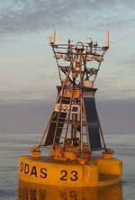

# noaa-rip.py
Buoys are cool. If you agree this script is for you.  
  
I present to you: ```noaa-rip.py```, a simple Python script to get all the buoy images from the NOAA website that are displayed on [the list](https://www.ndbc.noaa.gov/to_station.shtml) it goes thru all the stations in the list and fetches the image from the page (e.g. [41035](https://www.ndbc.noaa.gov/station_page.php?station=41035)).


